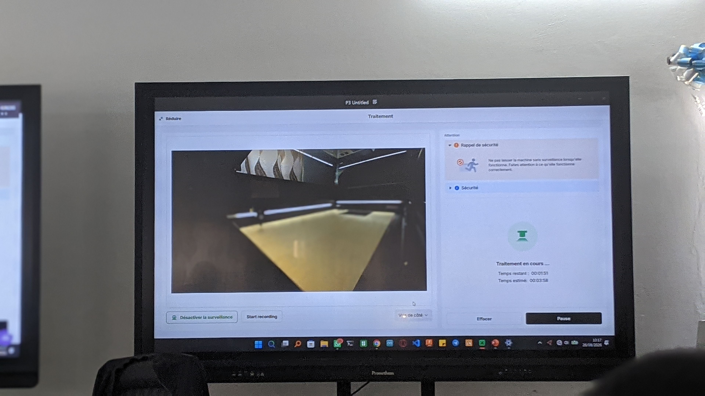
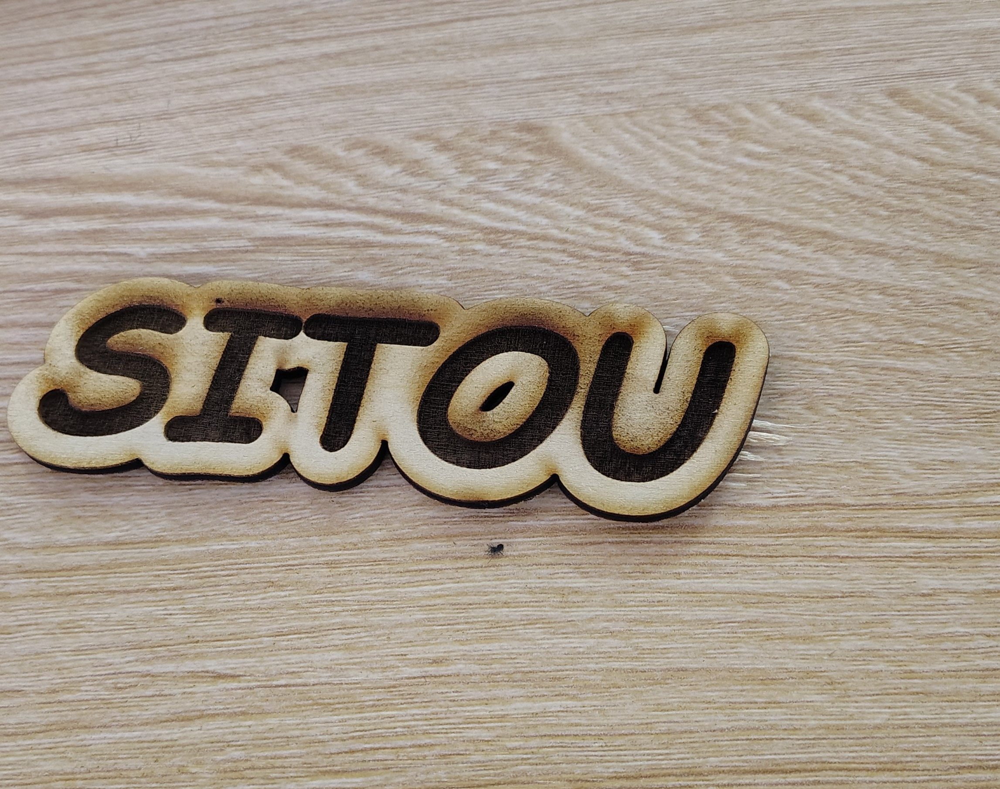

# Journal du 26 Août 2026(Rédigé par: KADANGA tchamiè)

## Fait aujourd'hui
- Contrôle de présence + Repartition en  groupe de 25 personnes
- **SECTION 1:** Visite de la salle Laser
- **SECTION 2:** Les bases de l'électronique dans les FabLabs
- **SECTION 3:** Des principes généraux à  l'impression 3D FDM 
- **SECTION 4:** Introduction sur les projets
## Appris
1. **Visite de la salle Laser**
    - Les fondamentaux de la technologie laser
    - Comparif des 4 machines xTool

| **Machine** |**Type de laser**|**Précisions** | **Métal pour**|**Puissance**|
|---|---|---|---|---| 
|F2 Ultra | Fibre MOPA + diode|0,2mm | Métal, bijouterie, marquage|60W+40W|
|P3 | CO2 |0,2mm | Bois/acrylique grand format | 80 W|
|MetalFab| Fibre industriel | 0,1mm | Découpe/ soudure métal épais| 800-1200W|
|M1 Ultra | Diode | 0,01 mm(gravure)| craft, pétites séries, pédagofie|10 -20w|

- Installation et prise en main du logiciel XTool
- Simulation + impression( sur la machine P3)
- 

### Rendu après gravure et decoupe
- 

- Les grandeurs éléctrique de base()

|**Tension**| **Courant** |**Résistance**|
|---|---|---|
|force qui pousse les électrons|débit d'électrons qui circule|ce qui freine le passage|
- mesure de la tension, l'intensité et de la résistance à base d'un multimètre

2. **Fonctionnement du breadboard((Arduino))**
La plaquette SKA 10 permet de faire des ciruits de prototypage
- sur un breadboard la connexion se fait:
    - **verticalement** sur les parties haut ett bas de la plaquette
    - **horizontalement** sur la partie du milieu 

3. **Fabrication additive: Des principes généraux à l'impression 3D FDM**
- Matière première --> filament
- fabrication additive..ajouter une matière couche/couche
- Deux technologies sont utilisées 
    - FDM
    - Resine SLA (polymérisation de la résine couche par couche)
- Logiciel utilisé: Fusion360
    - G-code langage que les machines comprennent.
    - Logiciel: Bambu LAb X1C

- **Trois logiques de fabrication**

|**Additive**|**Soustractive**|**Traditionnelle**|
|---|---|---|
|on ajoute de la matière couche par couche jusqu'à obtenir la pièce finale|on retire de la matière à partir d'un bloc brut, par usage mécanique|on met en forme la matière...*|
|*Ex:impression 3D FDM,SLA,SLS*|*Ex: fraisage,tournage, perçage*||

- **Les grandes familles de Technologies**
    - FDM/FFF
    - SLA
    - DLP
    - MSLA/LCD
    - SLC
    

## Raté, puis corrigé
RAS

## Décidé 

## A faire demain
- Faire du designThinking
- cahier de charge
- chercher les périphériques d'entrées et de sortie