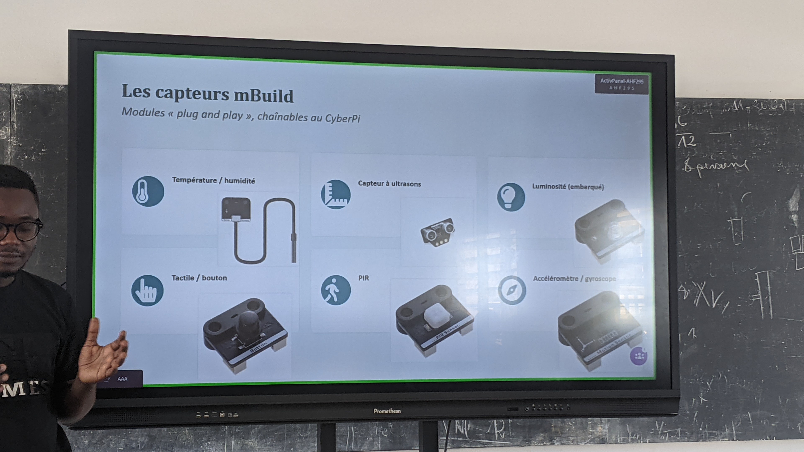
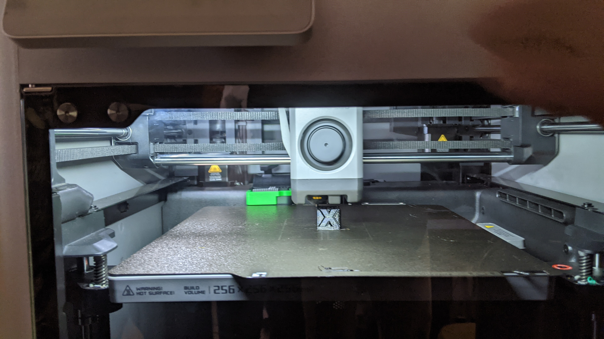
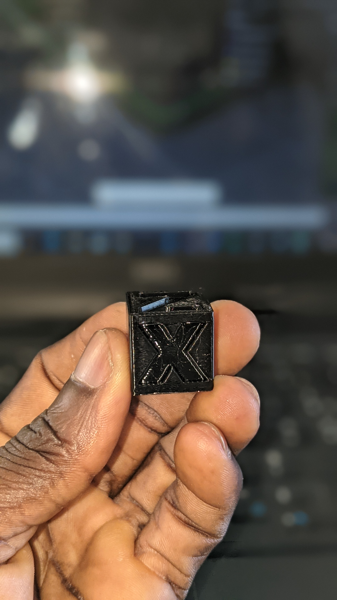
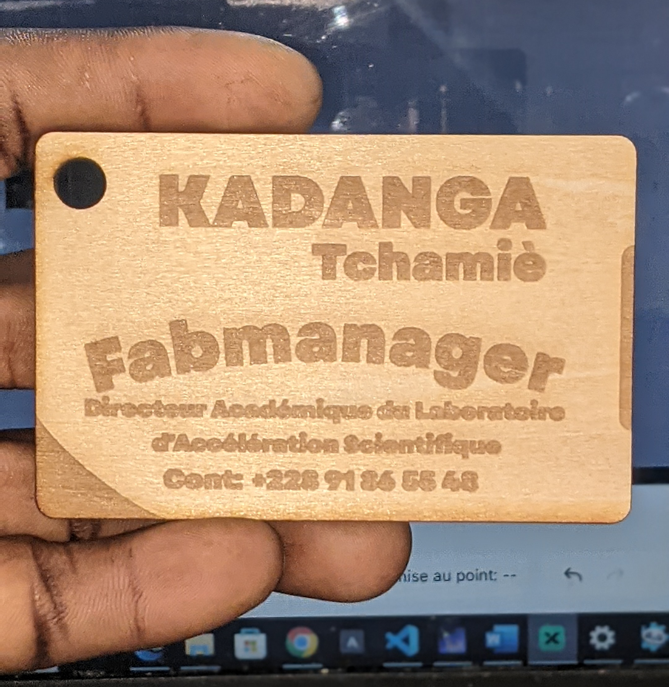

# Journal du 27 août 2026 (rédigé par KADANGA Tchamiè)

## Fait aujourd'hui
- **SECTION 1(salle électronique):** CyberPin  l'écosystème mBuild [*capteurs, actionneurs, projets pratiques et dimensionnement*]
- **SECTION 2(salle Impression 3D):** Prise en main du logiciel **BambuStudio** et simulation(impression) 
- **SECTION 2(Decoupe laser):** Carte de visite

## Appris
- **Identifier les composants du cyberPi(cerveau)**
- Les capteurs mBuild
    - Température/humidité
    - capteur à ultrasons
    - Tactile/bouton
    - PIR 
    - Luminosité(embarqué)
    - Accéléromètre/gyroscope(stabilité)
- De manière Générale  un capteur: mesure une grandeur physique de l'environnement
- capteurs de mouvement --> captur de présence --> capteurs de l'environnemnt --> capteurs de vison et de suivi

- 
- 
- Installation et prise en main du logiciel mBlock
- **Projet 1: Veilleuse automatique**
    - **Objectif:** allumer le LED automatiquement quand il fait sombre, l'éteindre le jour
    - **Algorithme:** en boucle, lire la luminosité; si < seuil, allumer(couleur chaude); sinon éteindre
    - **Notions abordés:** boucle infinie, condition si/sinon, règlage d'un seuil
    - **Prolongement :** faire varier la couleur ou l'intensité selon le niveau mesuré

- 2. **Du modèle 3D au G-code: le rôle du slicer**

*Schema simplifié*
- modèle 3D --> slicer --> paramètre --> slicing --> G-code -> Imprimante

- Installation et prise en main du logiciel BambuStudio
- Première impression 3D 

    **Paramètrage**
    - Filament de projet : Generic PETG
    - Hauteur de la couche: 0,24 mm

- 3. **Decoupe laser: Projet: Carte de visite**
    - Design de la carte dans xTool
    - Parametrage dans Xtool pour l'impression

| |**Decoupe**|**Gravure**|**Gravure de contour**|
|---|---|---|---|
|**Puissance**| Elevée(90%)|Faible(20%)|Faible(20%)|
|**Vitesse**|Lente(50mm/s)|Rapide(600mm/s)|Rapide(400mm/s)|
|**Nombre de passe**|1|1|1|

- **Rendu après decoupe**

## Raté, puis coorigé
RAS

## Décidé

##  A faire demain
- Chercher le Projet 1