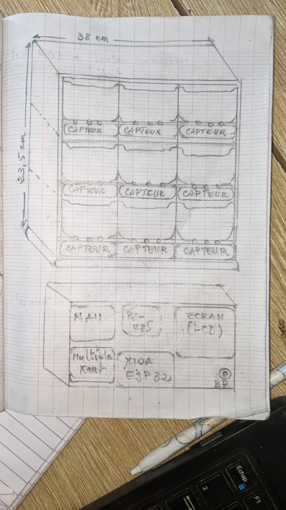
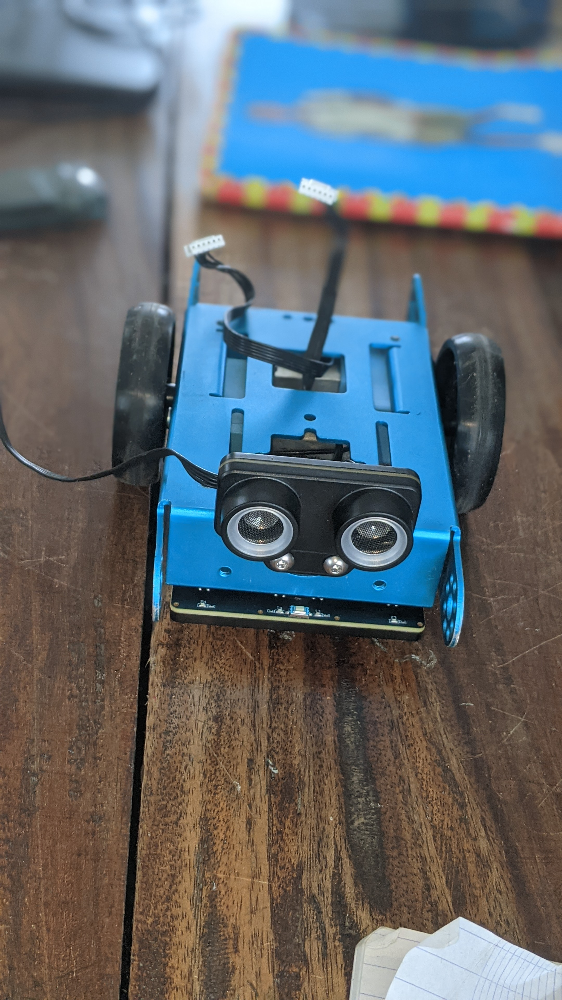
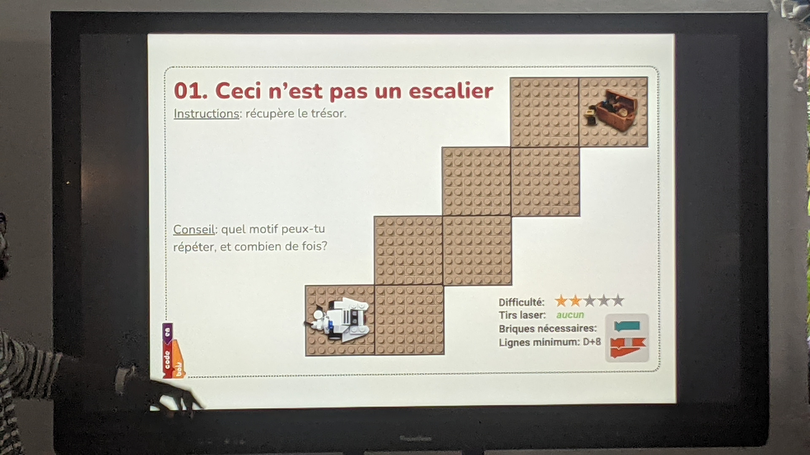
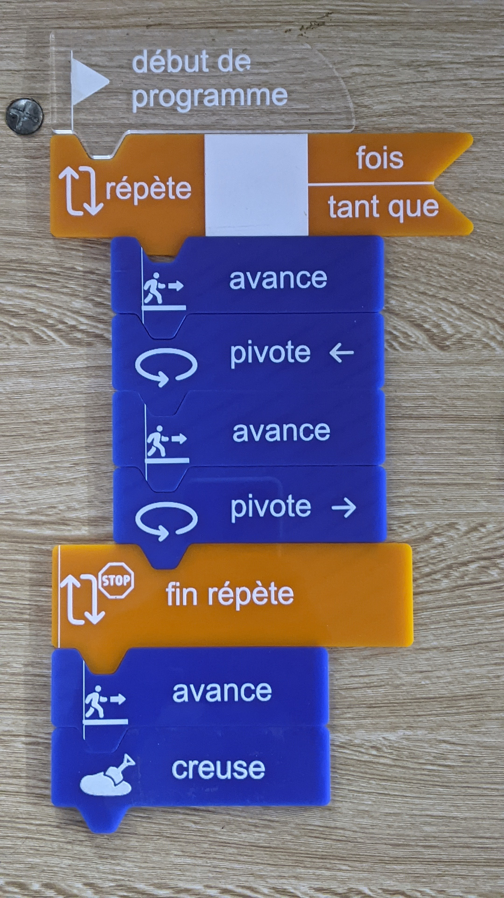

 # Journal du 02 setembre 2026(Rédigé par: KADANGA tchamiè)
 - **SECTION 1:(Salle principale)** DesignThinking
 - **SECTION 2:(ELECTRONIQUE) Comment utiliser Makeblocks pour programmer un robot**
 - **SECTION 3: (salle KADARING) Algorithme débranché**
 

 ## Fait aujourd'hui

 ## Appris
 1. **DesignThinking**

 il est question de mettre sur papier le fonctionnement ou les grandes étapes où encore une maquette .

 |Hauteur|Largeur|
|--|--|
|23.5cm|38cm|

 
  - **Image de référence**
  .jpg)
.jpg)

 - **fonctionnement d'une cellule**

 Materiaux dans une cellule --> capteur de poids --> NAU7802 --> Multiplexeur --> XIAO ESP32 --> affichage  + LED d'etat(Rouge ou vert)

**Problème majeur: où placer le capteur?**
 ---

 2. **Comment utiliser Makeblocks pour programmer un robot**
  - assemblage d'un robot 
  - ecrire le code mBlocks pour faire actionner le robot
  - **Projet 1:**

     - Déclencher un évènement --> faire avancer le robot pour toujours

     - Le robot ne fait que cogné des obstables sur son chemin  --> donc il est question de conditionner ---> à partir du capteur son et s'une boucle si

  

---

3. **Algorithme débranché**
- Historique

|Un algorithme | Une suite d'instructions finies et sans ambiguité|
|--|--|
|algorithme débranché| sans passer par un PC|

---

- Trois critères qui définissent un algo
    - une suite ordonnée d'intructions
    - un nombre fini
    - des instructions précises qui résovent une problématique donnée

- **Projet 1**

- resulat

 ## Raté, puis corrigé

 ## Décidé
 - Utiliser un poussoir(boutton) qui envoie l'état des cellules
 - Remplacer le multiplexeur

 ## A faire demain