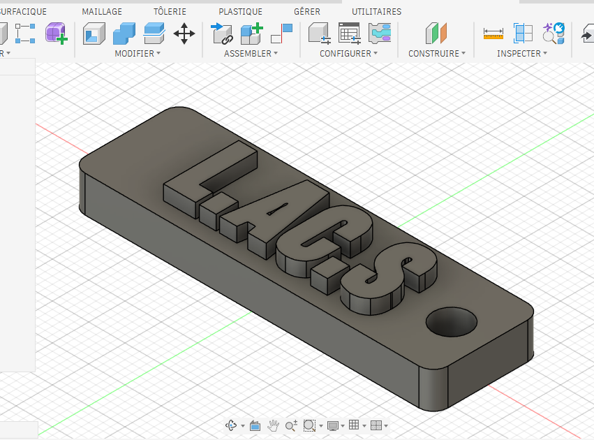
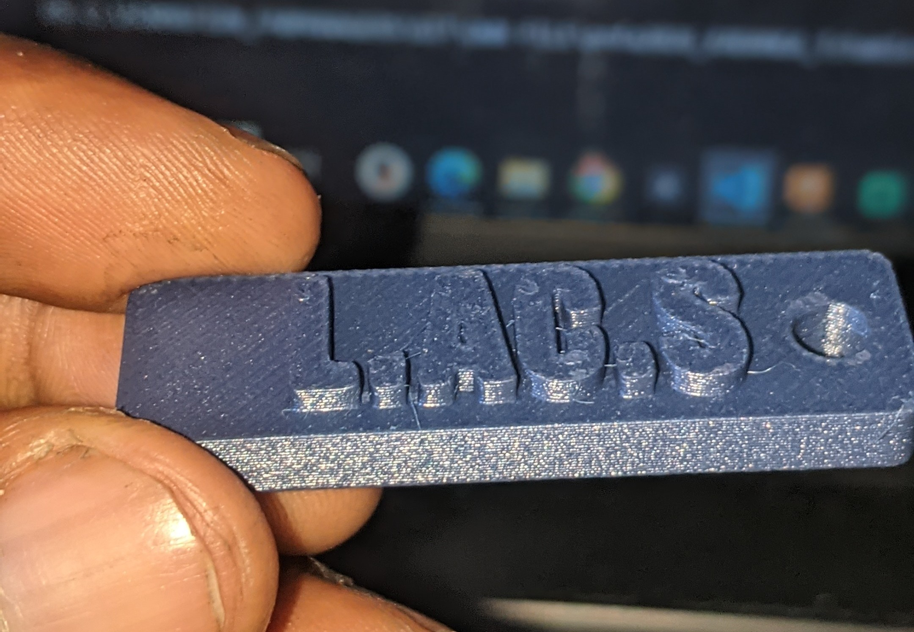
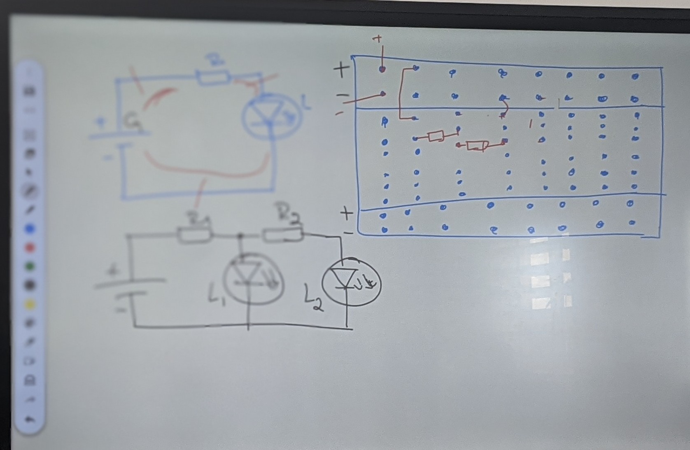
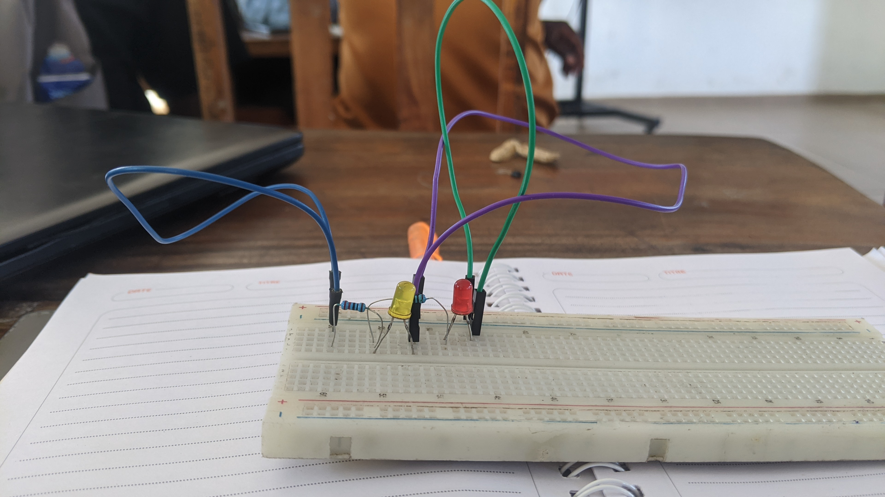

 # Journal du 01 setembre 2026(Rédigé par: KADANGA tchamiè)
 - **SECTION 1:(Salle principale)** Fusion 360
 - **SECTION 2:(ELECTRONIQUE) MAITRISE DE LA PLAQUETTE SK10**
 - **SECTION 3: (Salle KADARING): impression DTF**

 ## Fait aujourd'hui

 ## Appris
 1. - Comment créer des solide (cube, cylindre) à travers:
    - esquisse
    - la révolution
    - l'outils cylindre dans menu
- **Projet : personalisation d'une porte clé**

- **Resultat après conception**

---

2. **Les base de l'électronique**

|Eléctronique| - Rouge(+); Blue(-) |
|--|--|
|Haut et le bas ou les extrémités du breadboard| Continuité par ligne(horizontale)|
|Milieu(du breadboard) reservé pour placer les composants| connexion se fait par colonne|

- **ATTENTION: deux pates de deux composantes ne restent pas dans un même trou**

|**Tansistor**| 2N222 | BC 337|
|--|--|--|
|| EBC | CBE |

- 

.jpg)
---

3. **Impression DTF**
### Découverte de l'impression textile DTF avec xTool

Nous avons également découvert le procédé de **personnalisation textile par impression DTF (Direct To Film)** à l'aide d'une solution **xTool**.

Au cours de cette séance, nous avons découvert les différentes étapes nécessaires à la réalisation d'une impression textile.

#### Étapes de l'impression DTF

Le processus étudié et mise en pratique comprend les étapes suivantes :

- **Concevoir** : création ou préparation du visuel destiné à être imprimé sur le vêtement.
- **Imprimer** : impression du visuel sur le film DTF à l'aide de l'imprimante DTF.
- **Poudrer** : application de la poudre adhésive thermofusible sur la partie imprimée.
- **Cuire** : passage du film dans l'équipement de cuisson afin de faire fondre et fixer correctement la poudre.
- **Presser** : transfert du visuel sur le vêtement à l'aide d'une presse à chaud.
- **Retirer** : retrait du film DTF après le transfert afin de laisser apparaître le motif imprimé sur le textile.

#### Matériels utilisés ou présentés

Les principaux matériels nécessaires à la réalisation d'une impression DTF sont :

- une **imprimante DTF xTool** ;
- du **film DTF** ;
- des **encres DTF** ;
- de la **poudre adhésive thermofusible** ;
- un équipement destiné au **poudrage et à la cuisson** ;
- une **presse à chaud** ;
- un **vêtement ou textile à personnaliser**.

#### Première réalisation pratique

Nous avons réalisé notre **toute première impression textile**.

Au cours de cette première expérience pratique, j'ai personnellement participé aux premières étapes du processus en réalisant :

- la **conception du visuel** ;
- la **préparation du fichier pour l'impression** ;
- l'**impression du visuel**.

 ## Raté, puis corrigé

 ## Décidé

 ## A faire demain