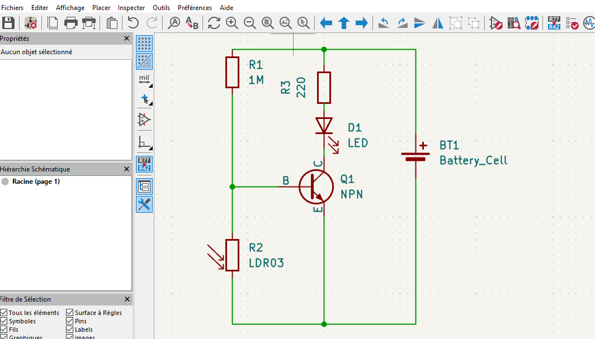
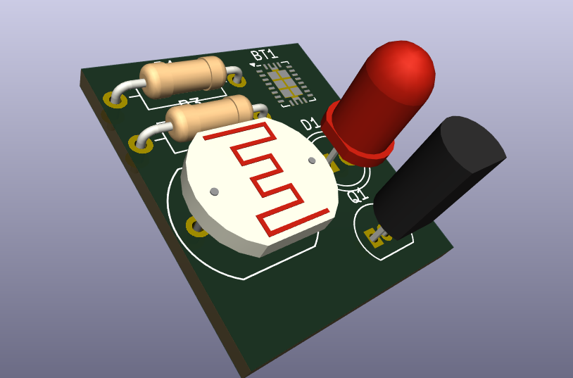
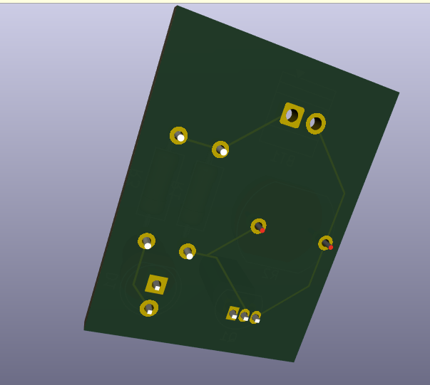
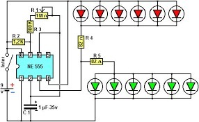

 # Journal du 07 setembre 2026(Rédigé par: KADANGA tchamiè)
 - **SECTION 1:(Salle principale)** COURS D'INITIATION AUX PCB
 de l'idée au circuit imprimé
 

 ## Fait aujourd'hui
 1. **Qu'est ce qu'un PCB?**

 
 ## Appris
 Un PCB: Printed ciruit Board(un circuit imprimé)
 - anatomie
 - Prise en main du logiciel Kidcad
    - realisation d'un circuit tout en amenant  les composants électroniques (LED, Resistance, Transistor NPN,un generateur.)

 
 

 ## Raté, puis corrigé
- Lors du choix des composantes

 ## Décidé
 

 ## A faire demain
 - exo de maison

 