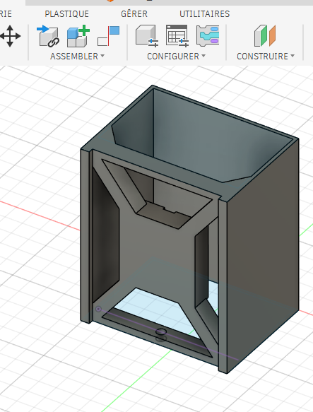
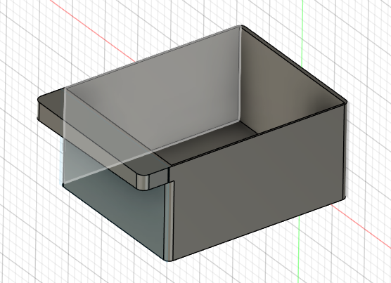
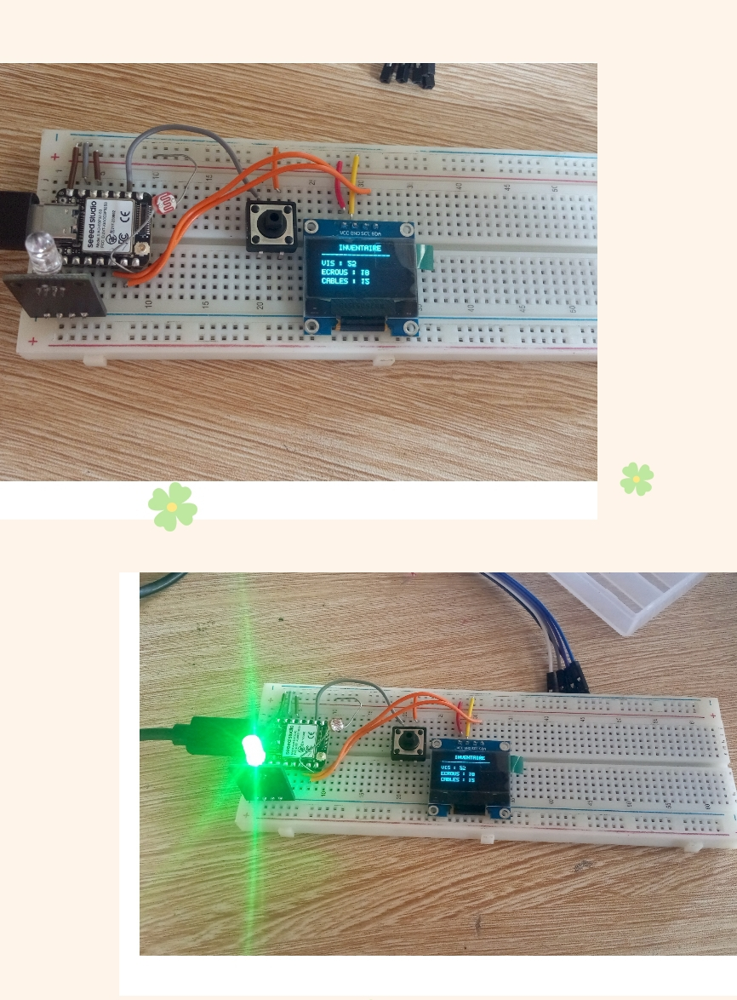

 # Journal du 12 setembre 2026(Rédigé par: KADANGA tchamiè)
 

 ## Fait aujourd'hui
 
 - design de notre armoire ainsi que les casier en tenant compte des modifications

-
-

- réalisation du circuit 
1- Réalisation du cicuit en PCB sur Kicad
> *Schéma du circuit électronique sur Kicad:*

 ## Appris

 **3- Simulation du circuit et Test des composants sur Breadboard SK10**
 
> *Réaliser le circurt électronique de quelques composants afin de Tester leur fonctionnement.*

> *Ecrire un code sur le logiciel Thonny pour allumer la LED RGB et afficher sur l'écran OLED la contenance d'un casier.*

 ## Raté, puis corrigé
- Emplacement de la LED raté 

 ## Décidé
 - Utiliser un poussoir(boutton) qui envoie l'état des cellules
 - Remplacer le multiplexeur

 ## A faire demain
 - Test Armoire + Tiroir + Composants électroniques.
- Programme d'affichage dans Thonny.
- Prototypage sur le Breadboard SK 10.